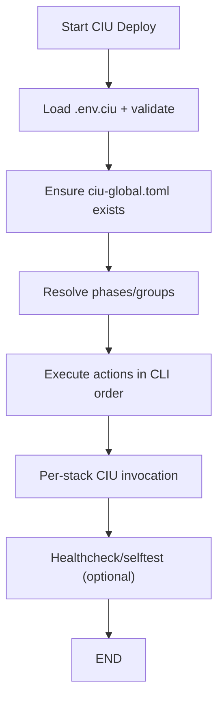

# CIU Deploy (ciu-deploy)

CIU Deploy orchestrates multiple stacks using deployment phases/groups from ciu-global.toml. It delegates all stack rendering and startup to CIU.

This document matches the current implementation and provides a clean-room reimplementation reference.

## Quick Start (User-Facing)

- Deploy all enabled phases:
  - ciu-deploy --deploy
- Stop + clean + deploy:
  - ciu-deploy --stop --clean --deploy
- Build images (Buildx Bake):
  - ciu-deploy --build
- List groups:
  - ciu-deploy --list-groups
- Deploy specific groups:
  - ciu-deploy --groups infra,apps --deploy
- Full external validation flow:
  - ciu-deploy --update-cert-permission --generate-env --stop --build --deploy --healthcheck external --selftest external

Why this order:
- `--update-cert-permission` ensures TLS certs are readable before compose.
- `--generate-env` ensures `.env.ciu` exists and is current.
- `--stop` + `--build` ensures fresh images and a clean start.
- `--deploy` starts the stack.
- `--healthcheck external` validates reverse‑proxy routes.
- `--selftest external` validates external connectivity.

## Actions (Ordered Execution)

Actions execute in the order specified on the CLI. If no actions are specified, --deploy is the default.

- --stop
- --clean
- --build
- --build-no-cache
- --deploy
- --render-toml
- --healthcheck [internal|external|both]
- --selftest [internal|external|both]
- --print-config-context
- --list-groups

## Workspace Env Options

- --generate-env
  - Generate .env.ciu with autodetected values before loading env
- --update-cert-permission
  - Update Let’s Encrypt cert permissions (requires root)

## CIU Global Options

- `ciu.require_certs` (default: false) enforces TLS cert readability for `DOCKER_GID`.
- `ciu.require_fqdn` (default: false) controls whether `PUBLIC_FQDN` must resolve during `.env.ciu` generation.

## Options (Modifiers)

- --services-only (stop only app services, keep infra running)
- --phases 1,2,3 (explicit phase numbers)
- --groups infra,apps (named groups)
- --ignore-errors (continue on error)
- --warnings-as-errors
- --repo-root / --root-folder (override repo root)

## Deployment Model (Phases & Groups)

Phases are ordered under [deploy.phases.*] and contain stack paths. Groups are aliases for sets of phases under [deploy.groups].

Example:
```
[deploy.phases.phase_1]
name = "Infra Core"
services = [
  { path = "infra/vault", name = "vault", enabled = true },
]

[deploy.groups]
infra = ["phase_1", "phase_2"]
apps = ["phase_4"]
```

## Orchestration Flow (Authoritative)



### Key Steps

1. **Load workspace env**
  - Validates .env.ciu keys (REPO_ROOT, PHYSICAL_REPO_ROOT, DOCKER_NETWORK_INTERNAL, PUBLIC_FQDN, TLS paths, etc.).

2. **Ensure global config**
   - If ciu-global.toml is missing, CIU Deploy renders it by invoking CIU with --render-toml on a stack anchor.

3. **Resolve phases/groups**
   - Named groups resolve to phase keys (phase_1, phase_2, ...).
   - Only enabled services are included.

4. **Execute actions**
   - stop: stops containers by labels and preserves volumes.
   - clean: runs init containers with CLEAN_DATA_DIR=true and removes vol-* dirs and rendered files.
   - build: docker buildx bake all --load (optionally --no-cache).
   - render-toml: calls CIU --render-toml for all selected stacks.
   - deploy: calls CIU for each stack in phase order.
   - healthcheck/selftest: calls HTTP endpoints for internal/external targets.

5. **Service containers**
   - Admin-debug and testing containers are excluded from stop/clean.

## Clean Behavior (Details)

Cleanup performs:

- Init-container cleanup with CLEAN_DATA_DIR=true
- docker compose down -v for each stack
- Bind-mount cleanup (vol-* directories)
- Removal of rendered docker-compose.yml and ciu.toml files
- Removal of vault-init.json when present

## Health/Selftest Behavior

Scopes:
- internal: container network checks
- external: reverse-proxy endpoints
- both: default

Expected endpoints:
- /health → {status, version, build_time}
- /health/selftest → {service_tests, test_status}

## Failure Handling

- Fail-fast by default; --ignore-errors continues.
- --warnings-as-errors elevates warnings to fatal errors.

## Developer Notes

- CIU Deploy does not render stack templates directly; it always invokes CIU.
- All docker commands are argv-based (no shell=True).
- Use docker buildx bake all --load for images (Buildx Bake workflow).
