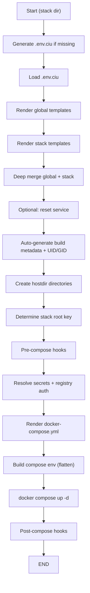
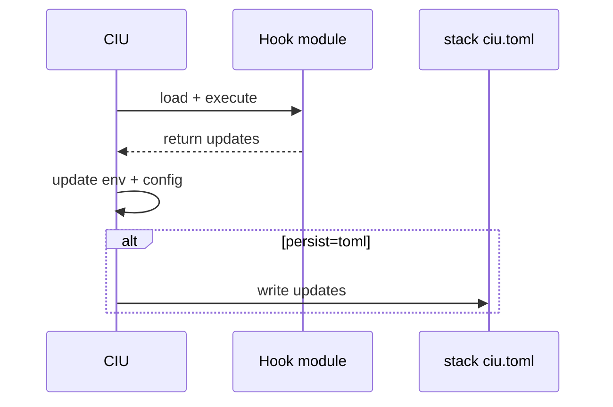

# CIU Engine (ciu)

CIU is the single-stack renderer and runner. It renders TOML templates, resolves directives, executes hooks, renders docker-compose.yml, and starts one stack.

This document is aligned to the current implementation and is sufficient for a clean-room reimplementation.

## Quick Start (User-Facing)

- Render and start a stack:
   - ciu -d infra/db-core
- Render TOML only:
   - ciu -d infra/db-core --render-toml
- Dry run (render only):
   - ciu -d infra/db-core --dry-run
- Print merged config:
   - ciu -d infra/db-core --print-context

## Command-Line Arguments (Authoritative)

### Core options

- -d, --dir PATH
   - Working directory containing service files (default: current directory)
- -f, --file NAME
   - Compose template name (default: docker-compose.yml.j2)
- -y, --yes
   - Non-interactive mode (auto-confirm prompts)

### Render/diagnostics

- --dry-run
   - Skip docker compose execution
- --print-context
   - Print merged configuration as JSON
- --render-toml
   - Render ciu.toml from templates (resets state)

### Workspace env

- --generate-env
   - Generate .env.ciu with autodetected values (overrides existing file)
- --update-cert-permission
   - Update Let’s Encrypt cert permissions (requires root)

### Version

- --version
   - Print CIU CLI version (build-date format: YYYYMMDD)

## CIU Global Options

The following options live under `[ciu]` in `ciu-global.defaults.toml.j2`:

- `require_certs` (default: false)
   - When true, CIU validates that the Let’s Encrypt cert/key files from `.env.ciu`
      exist and are readable by `DOCKER_GID` before compose starts.
- `require_fqdn` (default: false)
   - When true, CIU requires `PUBLIC_FQDN` to be present. When false, CIU allows
      `PUBLIC_FQDN` to fall back to the public IP or `localhost` during `.env.ciu` generation.

Optional metadata:
- `standalone_root`
   - Set to true to mark a repository as a standalone CIU project. CIU enforces
      that `REPO_ROOT` matches the directory containing the flag and will fail
      if CIU is executed from a nested path with a mismatched `.env.ciu`.

### Root selection

- --define-root PATH
   - Override repository root directory (no parent walking)
- --root-folder PATH
   - Alias for --define-root

### Skips/cleanup

- --skip-hostdir-check
   - Skip hostdir creation/validation (cleanup mode)
- --skip-hooks
   - Skip pre/post compose hooks
- --skip-secrets
   - Skip secret resolution/validation
- --reset
   - Clean service to fresh state (remove containers, volumes, configs)

## Inputs

- ciu-global.defaults.toml.j2
- ciu-global.toml.j2
- <stack>/ciu.defaults.toml.j2
- <stack>/ciu.toml.j2 (optional; override template)
- <stack>/docker-compose.yml.j2
- Optional hook modules (pre/post compose)

## Outputs

- ciu-global.toml (rendered, repo root)
- <stack>/ciu.toml (rendered)
- <stack>/docker-compose.yml (rendered)

## Workspace env (.env.ciu)

CIU uses .env.ciu as the authoritative workspace environment file. It should be
generated automatically when missing and sourced before running CIU/CIU Deploy.
Use `ciu --generate-env` to force regeneration.

### Gitignore guidance

These CIU-generated files must not be committed:

- .env.ciu
- ciu-global.toml
- ciu-global.toml.j2 (auto-created override template)
- **/ciu.toml
- **/ciu.toml.j2 (auto-created override template)
- **/docker-compose.yml

See the sample [ciu/.gitignored.ciu](../.gitignored.ciu) for a ready-to-copy list.

### Auto-source in VS Code

Options to auto-source .env.ciu when opening a shell:

1. Add to your shell init (recommended for devcontainers):
   - `~/.bashrc` or `~/.zshrc`
   - Example:
     - `[[ -f /workspaces/dstdns/.env.ciu ]] && source /workspaces/dstdns/.env.ciu`

2. VS Code terminal profile setting:
   - Set `terminal.integrated.shellArgs.linux` to source the file on launch.

3. Devcontainer post-create:
   - Add `source .env.ciu` in `.devcontainer/post-create.sh` after generation.

## Execution Pipeline (Authoritative)

The pipeline below matches CIU engine behavior:



### Step Details

1. **Load workspace env**
   - If .env.ciu is missing, CIU auto-generates it first.
   - `--generate-env` always regenerates the file before loading.
   - Reads .env.ciu and validates required keys via ensure_workspace_env.

2. **Render global config**
   - Ensures ciu-global.toml.j2 exists by copying defaults if missing.
   - Jinja2 render → expand env vars ($VAR/${VAR}) → parse TOML.
   - Deep merge defaults + overrides → write ciu-global.toml.

3. **Render stack config**
   - Same render/expand/parse flow for <stack>/ciu.defaults.toml.j2 and <stack>/ciu.toml.j2.
   - Deep merge defaults + overrides → write <stack>/ciu.toml.

4. **Deep merge**
   - Merge global config with stack config; stack wins on conflicts.

5. **Optional reset**
   - If --reset, run stack cleanup (compose down -v, remove vol-* dirs, remove rendered files, orphaned containers).

6. **Auto-generate values**
   - Build version/time from git.
   - UID/GID from deploy.env.shared (CONTAINER_UID, DOCKER_GID).

7. **Hostdir creation**
   - Scans for hostdir sections, generates missing paths (./vol-<service>-<purpose>), creates directories with UID/GID.

## Container Storage Permission Scenarios

CIU supports multiple storage patterns. Use the scenario below that matches the service runtime user and data requirements.

### Scenario A: Bind-mount data, service runs as non-root

**Use when**: service runs as a fixed UID (e.g., postgres), data must be visible on host.

**Pattern**:
- Define hostdir in TOML (so CIU can pre-create directories)
- Use an init container to `chown` data to service UID and `DOCKER_GID`
- Run the service as `<service_uid>:${CONTAINER_GID}` (docker group) so host users can manage files

**Notes**:
- `DOCKER_GID` must be present in `.env.ciu` (generated by CIU)
- Avoid hardcoded GIDs; use detected values
- Prefer `chmod 775` or `770` depending on your security requirements

### Scenario B: Bind-mount data, service runs as root

**Use when**: the service must run as root (e.g., nginx cache creation) or the image requires root.

**Pattern**:
- Mount bind directories directly
- Skip init container chown (root can write)
- Ensure least privilege in container configuration after startup

**Notes**:
- Use this only when required by the service; prefer non-root where possible

### Scenario C: Named volumes

**Use when**: host visibility is not required and you want simpler cleanup/permissions.

**Pattern**:
- Use Docker named volumes instead of host bind mounts
- Let the image manage ownership internally

**Notes**:
- Avoids host permission issues, but data is less accessible on the host

### Scenario D: Read-only config file mounts

**Use when**: mounting config files (not directories).

**Pattern**:
- Mount files read-only
- Ensure the host path resolves to a file (not a directory)

**Notes**:
- For CIU-generated compose, ensure file mounts resolve to absolute paths to avoid Docker creating directories

### Checklist

- Bind-mount data + non-root service → **init container chown to service UID + DOCKER_GID**
- Bind-mount data + root service → **no init container**, but justify root usage
- Named volume → **no host permissions required**
- Config files → **mount read-only, verify host path is a file**

8. **Determine stack root key**
   - CIU expects exactly one stack root key (excluding state). This key contains hooks.

9. **Pre-compose hooks**
   - Load and run hooks listed under <stack_key>.hooks.pre_compose.
   - Hook return values can update env and/or persist to ciu.toml.

10. **Secret resolution and registry auth**
    - Resolve directives (Vault/local/external).
    - Validate docker login if deploy.registry.url is set.

11. **Render docker-compose.yml**
    - Jinja2 render from merged config into docker-compose.yml.

12. **Compose env and docker compose up**
    - Flatten merged config into env vars.
    - Run docker compose up -d with injected env.

13. **Post-compose hooks**
    - Run hooks listed under <stack_key>.hooks.post_compose.

## Hook System (Authoritative)

CIU loads hook modules using this precedence:

1. Function hooks:
   - pre_compose_hook(config, env) -> dict
   - post_compose_hook(config, env) -> dict
   - run(config, env) -> dict
2. Class hooks:
   - PreComposeHook / PostComposeHook with run(...)

For class hooks, CIU:
- Instantiates class (env injected if __init__ accepts env)
- Sets hook_instance.config = config
- Calls run(config, env) if accepted, otherwise run(env)

### Hook return formats

Simple env updates:
```
{"VAR": "value"}
```

Metadata updates:
```
{"path.to.key": {"value": "x", "persist": "toml", "apply_to_config": true}}
```

Rules:
- persist=toml writes to the rendered <stack>/ciu.toml
- apply_to_config updates the in-memory merged config

### Hook Flow (Sequence)



## Compose Environment Flattening

CIU flattens the merged config into env vars:

- Nested keys become UPPER_SNAKE (join with underscores)
- Lists become comma-separated
- [env] keys become ENV_<KEY>
- PWD is injected

Example:
```
db_core.secrets.postgres_superuser_password
→ DB_CORE_SECRETS_POSTGRES_SUPERUSER_PASSWORD

[env]
REDIS_PASSWORD=...
→ ENV_REDIS_PASSWORD
```

## Fail-Fast Behavior

- Missing required .env.ciu keys abort execution.
- Missing deploy.env.shared values required for hostdir creation abort execution.
- Missing stack root key (or multiple root keys) abort execution.
- Registry authentication failures abort execution when registry.url is set.

## Common Edge Cases

- Hyphenated TOML keys break Jinja2 access: use underscores.
- Avoid default() in templates for required values.
- Use ${PWD}/file or ${PHYSICAL_REPO_ROOT}/file for file mounts.
- Let’s Encrypt certs are symlinks; mount the parent directory.

## Developer Notes

- CIU is stack-scoped only; orchestration is handled by CIU Deploy.
- No _template expansion phase exists; use Jinja2 + env expansion in TOML templates.
